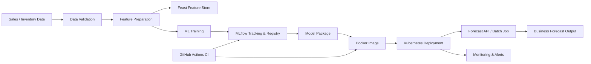

# Technical Architecture

The architecture is intentionally simple enough for a portfolio simulation while exposing realistic coordination points between data, ML, platform, security, and business teams.

## Component responsibilities

| Component | Responsibility | Primary owner |
|---|---|---|
| Data validation | Schema, completeness, consistency checks | Data Lead |
| Feature store | Reusable feature definitions and serving consistency | Data/ML Leads |
| MLflow | Experiment tracking and model lifecycle metadata | ML Lead |
| Model package | Reproducible model artifact | ML Lead |
| Docker | Portable runtime image | Platform Engineer |
| Kubernetes | Deployment and scaling | Platform Engineer |
| GitHub Actions | Automated checks and packaging workflow | Engineering Lead |
| Monitoring | Service/model health visibility | Operations Lead |

## Architecture decisions

### Decision 1 — Open-source first

The simulation prioritizes open-source components to reduce platform lock-in and align the portfolio with enterprise open-source environments.

### Decision 2 — Separate technical ownership from delivery ownership

The Project Manager is accountable for coordination and delivery outcomes, while technical leads remain accountable for engineering decisions.

### Decision 3 — Gate production-like releases

A release cannot pass from technical readiness to business pilot unless data, security, deployment, rollback, and acceptance checks are complete.
